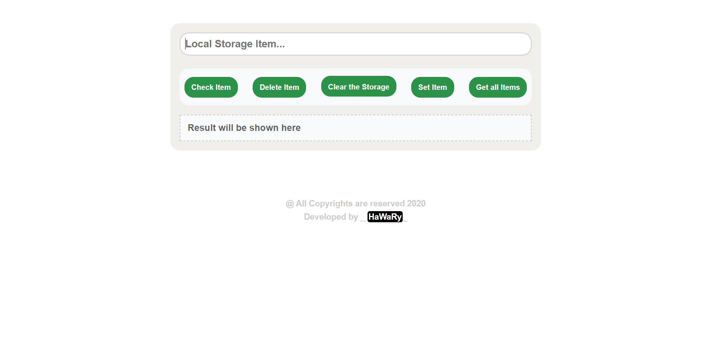

# Control Local Storage

 

Control Local Storage is an App. let you have a Full Control on the Local Storage Items (Check, Delete, Set or Get all Items) also Clear the Storage from all Items.
  

## Demo and How to Interact

## Getting Started

You can try the APP from [here](https://mohamed-elhawary.github.io/control-local-storage/)

### Prerequisites

Just Modern Browser like "Chrome" and a Code Editor for Deployment and Develop.

## Built With

* HML5
* CSS3
* Vanilla JS 

## Author

* Mohamed Elhawary  

## Contact Me  

* Email: mohamed.k.elhawary@gmail.com

## Deploy with Me

Feel Free to Deploy it with me, send Issues or a Pull Request and i'll deal with you, just test it First.

## License

Licensed under the [MIT License](LICENSE)

